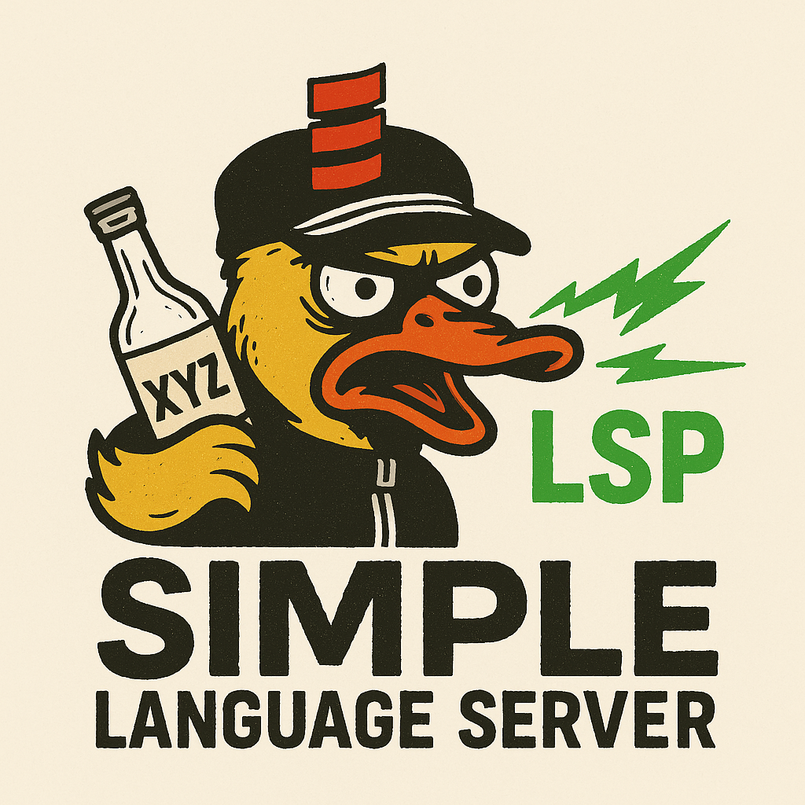

## Tracer command



You should have langoustine-tracer launcher in server root.

```bash
cs bootstrap tech.neander:langoustine-tracer_3:latest.release -f -o langoustine-tracer
```

## Debugging the presentation compiler

The PC is loaded from `org.scala-lang:scala3-presentation-compiler_3` at the build target's own
Scala version. To test a different PC build (e.g. a locally `publishLocal`-ed dotty), override the
version at launch — no recompile:

```bash
# all modules
SLS_PC_VERSION=3.8.4-RC1-bin-SNAPSHOT ./mill sls.run        # or -Dsls.pc.version=...

# per module (keyed by build-target display name); falls back to SLS_PC_VERSION, then the target's version
SLS_PC_VERSIONS='sls=3.8.4-RC1-bin-SNAPSHOT,zincCli=3.8.3' ./mill sls.run   # or -Dsls.pc.versions=...
```

Coursier's `ivy2Local` is on the default resolver, so a `publishLocal`-ed snapshot resolves directly.
An active override is logged per module on PC creation.
